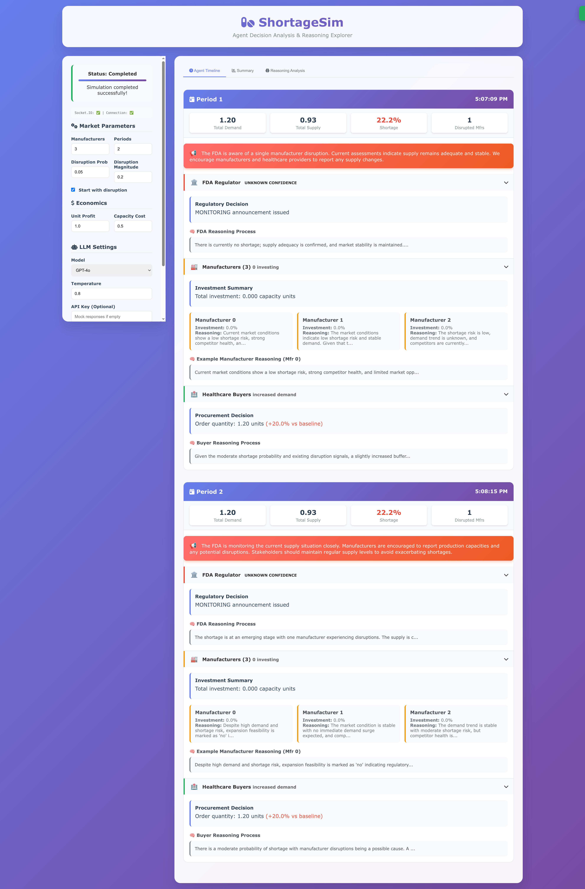

# ShortageSim: Simulating Drug Shortages under Information Asymmetry

## 📋 Overview

ShortageSim is a comprehensive multi-agent simulation framework that models pharmaceutical supply chain dynamics during drug shortage events. By leveraging Large Language Models (LLMs) to power agent decision-making, the system captures realistic responses to regulatory signals and market conditions under information asymmetry.

### 🎯 Research Motivation

Drug shortages regularly disrupt patient care and impose major costs on health systems worldwide. While the FDA issues alerts about potential shortages, the effectiveness of these interventions remains poorly understood due to:

* **Information Asymmetry** : FDA cannot observe individual manufacturers' inventory levels or buyers' procurement plans
* **Strategic Behavior** : Alerts may trigger stockpiling, potentially exacerbating shortages
* **Complex Interactions** : Multiple stakeholders with conflicting objectives

ShortageSim addresses these challenges by simulating realistic agent behaviors and evaluating policy interventions.

## 🚀 Key Features

* **🤖 LLM-Powered Agents** : Manufacturers, buyers, and FDA regulators with sophisticated decision-making
* **📊 Realistic Market Dynamics** : Supply disruptions, capacity investments, and demand allocation
* **🏛️ Policy Evaluation** : Test reactive vs proactive FDA intervention strategies
* **📈 Ground Truth Validation** : Calibrated against historical FDA shortage data
* **📝 Comprehensive Logging** : Detailed tracking of all decisions and market states
* **🔧 Modular Architecture** : Easily extensible for new agent types and behaviors

## 📦 Installation

### Setup

```bash
# Install dependencies
conda create -n ShortageSim python=3.12
conda activate ShortageSim
pip install -r requirements.txt

# Set up your OpenAI API key in Terminal or add your key to keys/openai.txt
export OPENAI_API_KEY="your-api-key-here"

# Run setup test to verify installation
python src/test_setup.py
```

## 🎮 Usage

### 🔗 Test on Our Web Interface!

```
python shortagesim.py
```



### Running Experiments

```bash
# Single simulation with disruption
python src/main.py

# Comparative study across scenarios
python src/main.py comparative

# Ground truth validation experiments
python src/main.py gt_experiment_dic    # For discontinued cases
python src/main.py gt_experiment_nodic  # For non-discontinued cases

# Policy effectiveness test
python src/main.py policy

# Use different models
# We support OpenAI, Anthropic, Google, and DeepSeek
python src/main.py --provider anthropic --model claude-3-5-sonnet-20240620
```

## 🏗️ System Architecture


### Core Components

1. **Environment Module** : Manages market dynamics, disruptions, and state transitions
2. **Agent System** : LLM-powered decision makers (manufacturers, buyers, FDA)
3. **Information Flow** : Controls inter-agent communication and enforces information asymmetry
4. **Simulation Controller** : Orchestrates execution and comprehensive logging

### Agent Decision Pipeline

Each agent follows a two-stage LLM pipeline:

```
Stage 1: Collector & Analyst
├── Input: Raw market context and signals
├── Process: Extract structured state via LLM
└── Output: JSON with analyzed market conditions

Stage 2: Decision Maker  
├── Input: Structured analysis from Stage 1
├── Process: Strategic decision-making via LLM
└── Output: Action + detailed reasoning
```

## 📊 Market Mechanics

### Disruption Modeling

* **Probability** : $\lambda = 0.05$ per manufacturer per period
* **Magnitude** : $\delta = 20\%$ capacity reduction
* **Duration** : $U\{n\}$ periods
* **Recovery** : Gradual capacity restoration

### Supply-Demand Allocation

1. Equal initial allocation: $D_t / N$ per manufacturer
2. Disrupted firms produce: $\min(capacity, allocation)$
3. Unfilled demand redistributed to healthy firms
4. Market shortage calculated as: $\max(0, D_t - total\_supply)$

### Agent Objectives

| Agent                  | Role                  | Objective                             | Key Decisions                         |
| ---------------------- | --------------------- | ------------------------------------- | ------------------------------------- |
| **Manufacturer** | Pharmaceutical CEO    | Maximize profit while managing risk   | Capacity investment (0-30% expansion) |
| **Buyer**        | Healthcare consortium | Minimize costs (purchase + stockout)  | Order quantity adjustment             |
| **FDA**          | Regulatory agency     | Minimize shortage duration & severity | Issue public announcements            |

## 📈 Evaluation Metrics

### Primary Metrics

1. **FDA Intervention Percentage (FIP)** : Fraction of periods with FDA announcements
2. **Resolution-Lag Percentage (RLP)** : Timing accuracy vs ground truth

$$
RLP = 100 × (t_{sim} - t_{GT}) / t_{GT}
$$

### Performance Results

| Dataset  | Avg FIP (%) | Avg RLP (%)      | Description                     |
| -------- | ----------- | ---------------- | ------------------------------- |
| FDA-Disc | 79.1        | **1.40**   | Discontinued manufacturer cases |
| FDA-NR   | 37.5        | **-22.70** | No disclosed reason cases       |

## 🔬 Experimental Framework

### Ground Truth Validation

The framework includes comprehensive validation against 51 historical FDA shortage events:

```python
# Load ground truth data
df = pd.read_csv("data/GT_Disc.csv")

# Run validation experiments
results = await run_gt_experiments(
    df, 
    n_simulations=3,      # Multiple runs per case
    export_dir="gt_evaluation"
)
```

### Customizing Agent Behaviors

Modify agent prompts in `src/prompts.py`:

```python
def get_manufacturer_prompts():
    return {
        "system_template": """You are the CEO of a pharmaceutical company...""",
        "user_template": """Current market state: {market_context}...""",
        "expected_keys": ["investment_decision", "reasoning"]
    }
```

## 📊 Logging and Analysis

The framework includes comprehensive logging at multiple levels:

```python
simulation_logs/
└── session_20250102_143022/
    ├── simulation_log.json      # Complete event log
    ├── market_states.json       # Period-by-period states
    ├── agent_decisions.json     # All agent decisions
    └── summary_metrics.json     # Aggregate results
```

## 🤝 Contributing

We welcome contributions! Areas of particular interest:

* [ ] Proactive FDA agent implementation
* [ ] Multi-drug market extensions
* [ ] International supply chain modeling
* [ ] Alternative LLM backends (Claude, Llama, etc.)
* [ ] Interactive visualization dashboard

## Citation

```
@misc{ShortageSim,
      title={ShortageSim: Simulating Drug Shortages under Information Asymmetry}, 
      author={Mingxuan Cui and Yilan Jiang and Duo Zhou and Cheng Qian and Yuji Zhang and Qiong Wang},
      year={2025},
      eprint={2509.01813},
      archivePrefix={arXiv},
      primaryClass={cs.MA},
      url={https://arxiv.org/abs/2509.01813}, 
}
```
